Yet Another Anthro Art Tutorial
===============================

_Archived from [http://hippie.nu/~unicorn/tut/xhtml/](https://web.archive.org/web/20160830153627/http://hippie.nu/~unicorn/tut/xhtml/)_

Table of Contents
=================

*   [I. The Basics](#basics)
*   [II. Appendices](#appendices)

Part I. The Basics
==================

I bet you've tried it already (or you've seen it happen): you wander into an art forum, and announce you would like to learn how to draw. The first advice you usually get is “draw a lot”, or “practice practice practice”. And this is exactly what you should be doing. Your drawing skills won't improve just by reading about it.

However, drawing the same mistake over and over again is not the most efficient way to improve your skills. The first part of the tutorial will show you some of the basic principles, and hopefully will help you to practice in a more focused way.

For now, we'll stick with realism. Don't let this discourage you if your favorite style isn't realistic, though! Unless you're an abstract artist, the basis of your favorite style is the world around you. So let's tackle that first, it's difficult enough already without adding all sorts of stylistic conventions.

Table of Contents
-----------------

*   [1\. Sketching](#basics-sketching)
*   [2\. Human anatomy and figure drawing](#basics-humananatomy)
*   [3\. Animal anatomy](#basics-animal)
*   [4\. Tying it all together: anthros](#basics-anthros)
*   [5\. Light and shadow](#basics-lightshadow)

Chapter 1. Sketching
--------------------

### Table of Contents

*   [Organic shapes](#basics-sketching-organic)
*   [Geometric shapes](#basics-sketching-geometric)
*   [Spheres and guidelines](#basics-sketching-sphere)
*   [Exercises](#basics-sketching-exercises)

The second bit of advice a beginning artist usually gets is “draw from life”. And it is excellent advice! After all, if you can't draw what is right in front of you, you certainly won't be able to draw what you see in your imagination either. But the advice is a bit short, and will usually leave the artist behind unsure of what to do next. This chapter will help you to get started by explaining some different sketching methods you can use.

Materials? Ah yes. No tutorial would be complete without discussing the materials first. It's tradition!

  

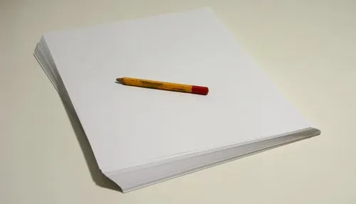

**Figure 1.1. Materials you'll need**

  

So... a ream of the cheapest copier paper you can find, or in a pinch, the inside of a pizza box. A pencil, a burned match, or anything else that leaves a mark. And a pencil sharpener or a knife to keep it sharp. Don't worry about fancy stuff like erasers just yet.

Organic shapes
--------------

The most important thing to keep in mind is to start with the largest shapes, and gradually work down to the small details. This allows you to regularly check your angles and proportions. The earlier you catch a mistake, the easier it will be to fix it. The idea is to draw imaginary lines through the important points of your subject, and use a couple of checks to make sure they are accurate, such as using easy divisions (halves and thirds), and checking against horizontal and vertical lines.

The best way to explain this is by example. Let's make a sketch of what is possibly the fandom's most popular critter, the red fox:

  

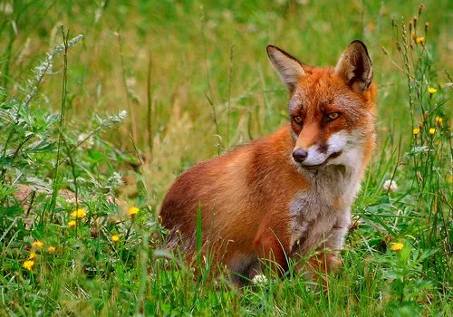

**Figure 1.2. [Photo of a red fox](#credit-thyssen)**

  

The first step is to block in the large shapes. On the left you can see the imaginary lines I've picked as the basis. The sketch is still very light at this point: the idea is to make the corrections on the fly, instead of slowing yourself down by erasing lines.

  

**Figure 1.3. Blocking in the outline**

  

Now pause and check if everything is still correct. I'm going to give a few examples of what you could look for, so you can get a rough idea of this process.

The proportions are okay: the line through the eyes is supposed to be a bit below halfway (say, at 5/8ths) the lines of the ear tips and the chin. Also, if I draw an imaginary line from the intersection near the left eye to the right ear tip, or from the mouth to the ear's base, the angle is the same on the sketch.

  

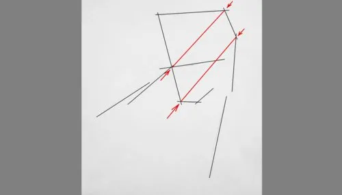

**Figure 1.4. Checking angles and lengths of imaginary lines**

  

Eyeballing diagonal lines through your figure is called “caliper vision” by \[[Ryd](#biblio-ryd)\]. Ryder uses the block-in and the caliper measurement only on the contour, not on features inside the contour such as eyes or a mouth. Personally, I prefer using the same system for the entire subject. It's only a tool, how you use it is up to you.

The line through the eyes doesn't have quite the right angle though. It should be rotated clockwise a bit. I'm keeping this in mind as I use this line to place the eyes in the next step:

  

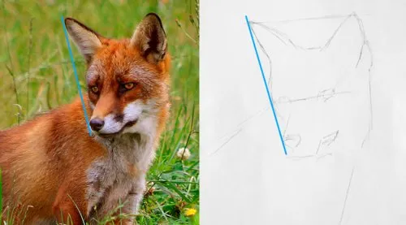

**Figure 1.5. Placing the eyes and muzzle**

  

With the ears, eyes, nose, and mouth indicated, it's time for a check again. If we look at one of the original construction lines, it's easy to spot the mistake here. The cheek is way too close to this line.

  

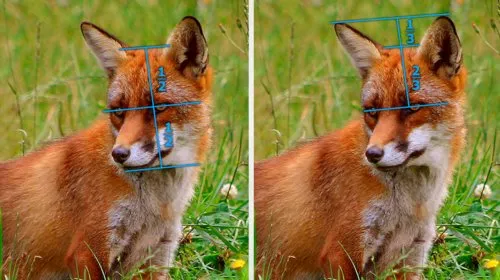

**Figure 1.6. Checking proportions**

  

The top of the head seems okay; the distance to the eye line is the same as the distance from the eye line to the chin. Or, from the eye line up to the ear tip line, it's approximately at two-thirds.

  

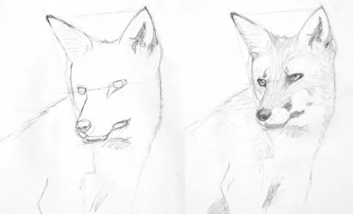

**Figure 1.7. Refining the sketch**

  

The cheek is fixed, and the sketch is really starting to take shape now. I added some details and shading to show how the process would continue.

I realize this bears an eerie resemblance to the many “How to draw a <insert subject here>” tutorials. But although I could add a jarring background, post it to DeviantArt, and call it a day (tempting, tempting...), I hope it's clear that this is not the intention. I'm not trying to teach you how to draw a fox, not yet at least. I'm just showing you how to approach a sketch.

These techniques are not just for copying photos, you can also sketch from life in the same way. It is a little more difficult, so if you'd like to practice with 2-D references first that's okay. Instead of drawing blue construction lines on a photo, some people use a thin knitting neeule or a piece of thread. You hold it in front of you while closing one eye, and check if everything lines up the same way as on your paper.

Now go grab your pencil and your cheap paper, and sketch whatever you find interesting. It doesn't matter if it is a pet, a person, or the spontaneous still life on your desk. The goal right now is to learn to draw what you see, develop your sense of proportions and angles, and train your eye-hand coordination.

Geometric shapes
----------------

A lot of subjects can be simplified to geometric shapes, such as boxes, pyramids, cylinders, and spheres. Instead of starting with the large shapes on paper, you simplify your subject in 3-D.

This section is also a crash course in perspective drawing. You'll need this to draw the basic shapes, but it is also a useful tool in case you don't have a reference for something, or if you don't want to make a perfect copy. As long as you work according to the rules, it will look good.

We'll look at perspective in more detail in chapter 9. All you need to remember for now is that lines that are parallel in the real world, will converge to a single point in your drawing. Such points are called vanishing points.

First, the cube. Here you can see how parallel lines intersect at a common point:

  

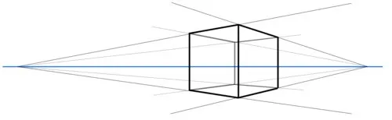

**Figure 1.8. A cube and two vanishing points**

  

The cube is transparent, so you can see all its edges. There are four parallel edges with the vanishing point on the left, another four with the vanishing point on the right, and four edges that we are looking at straight on. (Their vanishing point is so far away we can ignore it, and draw the lines vertical.)

By placing the vanishing points more to the left or to the right, we can rotate the cube.

  

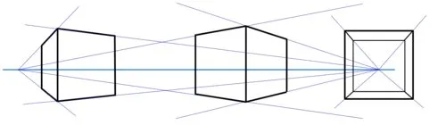

**Figure 1.9. Drawing the cube from different angles**

  

If we tilt the cube with the top towards the viewer, the third vanishing point (the one that was too far away at first) comes into view.

  

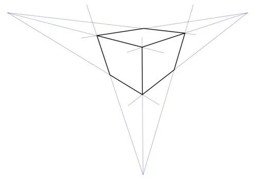

**Figure 1.10. A cube and three vanishing points**

  

The center of one of the sides of a box can be found by drawing a cross between the corners. If we know the exact midule of the top side of a cube, we can use this point as the tip of a pyramid:

  

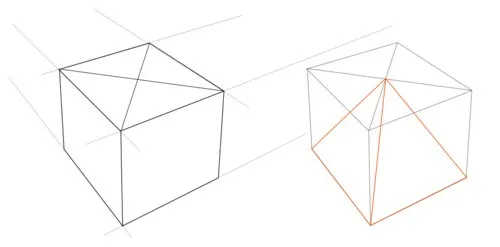

**Figure 1.11. Finding the midule of a face, and constructing a pyramid**

  

By adding two more lines through the center, you can divide a side into 4 smaller squares. You can use this as a guide for drawing a circle in perspective. The circle will always touch the edges of the square in the midule, at the point where we have drawn the extra two guidelines. And it will cross the diagonals at a little less than three quarters from the center.

  

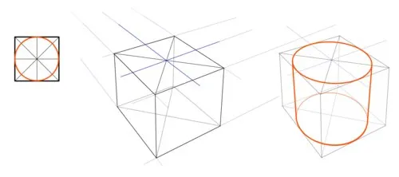

**Figure 1.12. Constructing a circle from a square, and a cylinder from a cube**

  

The cube is drawn transparently here to make it clearer how both the top and the bottom face are turned into a circle in correct perspective. Note that the straight sides of the cylinder are parallel to the upright edges of the cube, and therefor have the same vanishing point.

Cylinders of various lengths are often used to draw a character's body. So practice a bit with drawing them at different angles, this will help you with foreshortening later on.

  

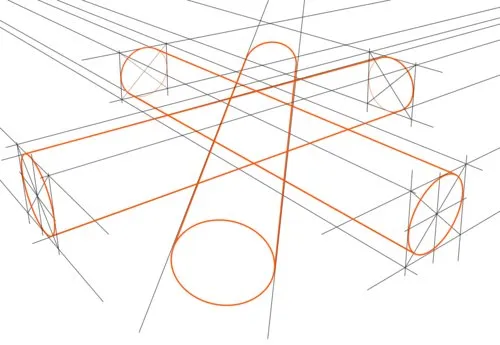

**Figure 1.13. Long cylinders at different angles**

  

Here you can see a longer, thinner cylinder drawn at three different angles. Two are exactly perpendicular, so they use the same two vanishing points (which are located outside the drawing). The one that we are viewing lengthwise has its own vantage point.

Now let's draw something! Man-made objects are great subjects to simplify to geometric shapes:

  

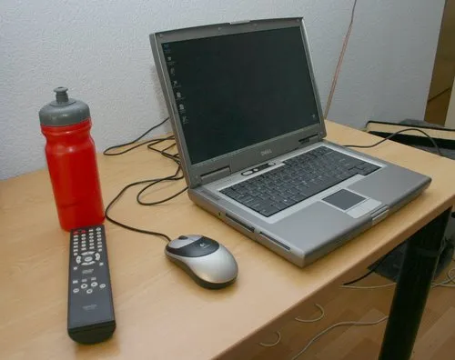

**Figure 1.14. Photo with strong perspective distortion**

  

This photo has been taken from up close with a wide angle, to exaggerate the effect of perspective. Don't put your vanishing points this close together in your own drawings, unless you're using the exaggeration for some effect.

The edges of the table and the base of the laptop share the same two vantage points. They are outside the paper, to the top left and the top right. There's also a third vantage point for all vertical edges (such as the leg of the table and the sides of the bottle), far down.

Start with the basic shapes: a flat box for the table, another one for the base of the laptop. And just like Juan Gris, we're going to make a bottle out of a cylinder. Some construction lines end in an arrow; if the drawing were bigger, these lines would be longer and meet at the vanishing point.

  

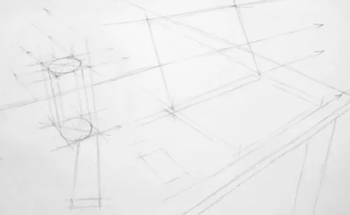

**Figure 1.15. Blocking in the shapes using simple boxes**

  
  

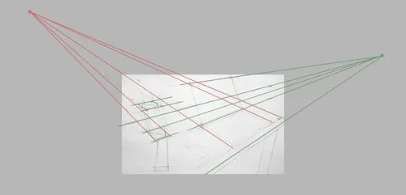

**Figure 1.16. Extended lines meet at the vanishing points**

  

I've drawn crosses on the laptop base and screen to find the line that runs right through the midule. I use this line to place the latch, and to determine where the curve at the top of the screen reaches its highest point. More guidelines towards the vantage points are used to draw the keyboard and the trackpad.

  

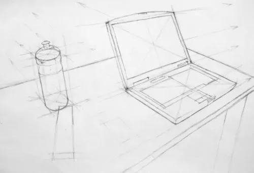

**Figure 1.17. Refining the shapes**

  

The top of the water bottle was added using the center line as a guide. The center line runs through the midule of the top and the midule of the bottom, and we already found those by drawing crosses.

Spheres and guidelines
----------------------

A sphere with guidelines is a popular basic shape for drawing heads. While it is not as important as the other sketching techniques, you are going to see it a lot throughout this tutorial, especially in the chapters about animal anatomy and anthros.

Now a sphere is easy enough; you grab a compass, draw a circle, there's your sphere. However, we'll also need some guidelines, and that's the tricky bit. Here, take a look at some examples.

  

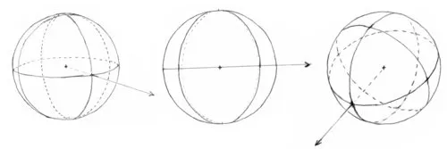

**Figure 1.18. Spheres**

  

As you can see, I've drawn three lines on the sphere. A horizontal one, and two vertical ones. Also, there's arrow sticking out. This indicates where the nose points to. We're going to use these guidelines to locate the facial features, and make sure our characters don't end up looking like a Guernica reject.

A guideline on a sphere will look like an ellipse if it turns away from the viewer. Drawing an ellipse takes some practice, and I'll show you a couple of things you'll need to keep an eye on. First of all, there are six points on the sphere's surface where the guidelines cross each other. The point where the arrow is sticking out is one of them. A straight line between two opposite intersections passes through the midule (where you put the neeule of your compass). You can see that in the next figure on the left:

  

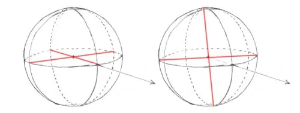

**Figure 1.19. Intersections are at the opposite ends**

  

On the right you see something similar, but this time it's for the points where the ellipse touches the outer circle. Again, a straight line through two opposite points goes through the midule.

The ellipse must also be symmetrical. Check if the distance to the center is the same on both sides:

  

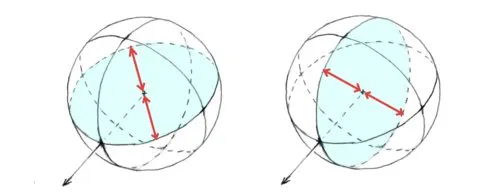

**Figure 1.20. Symmetry**

  

Don't sweat it, though. These are just a couple of things you can use to judge your ellipse by eye. You shouldn't go and break out a ruler to get it absolutely perfect.

Okay, let's do something useful with it. The horizontal guideline is used often for placing the eyes. You already know in what direction your character is looking, so all you need to do is to place the eyes at the same distance from the center. I've indicated the measurements in red, and the eyes themselves in blue:

  

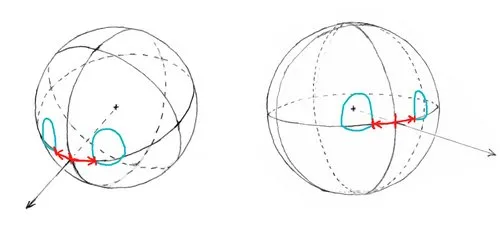

**Figure 1.21. Placing eyes symmetrically**

  

Using the two vertical guidelines, we can do the same for ears. Again, the red arrows show the measurements taken to make sure everything is symmetrical.

  

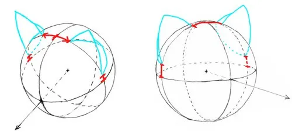

**Figure 1.22. Placing ears symmetrically**

  

This was only a quick introduction to drawing faces, there's much more to come in chapters 3 and 4.

Exercises
---------

*   Draw from life and from photos. If I had to write a tutorial in six words, this would be it.
*   If you are using a reference photo, copy it upside down. This way, you force yourself to concentrate more on the edges and proportions, instead of what they represent. This also makes it easier to spot your own mistakes when comparing your sketch to the photo right side up.
*   After drawing from a photo, or even better, from real life, look at your sketch in a mirror. This is a good way to spot if your drawing is slanted. Next time, keep this slant in mind and try to compensate for it.
*   Drawing a straight line is easy, they invented rulers for that. But you can save yourself some time if you can do it freehand. You'll have to work from the shoulder and the elbow for this, and it may take some time to get good results. Try drawing your guidelines without a ruler, and use a ruler afterward to check how close you are to a straight line.

Chapter 2. Human anatomy and figure drawing
-------------------------------------------

### Table of Contents

*   [The body's proportions](#basics-humananatomy-proportions)
*   [The chest](#basics-humananatomy-chest)
*   [The back](#basics-humananatomy-back)
*   [The arms](#basics-humananatomy-arms)
*   [The hand](#basics-humananatomy-hands)
*   [The hips and legs](#basics-humananatomy-legs)
*   [Male and female bodies](#basics-humananatomy-malefemale)
*   [Poses](#basics-humananatomy-poses)
*   [Exercises](#basics-humananatomy-exercises)

Before we start, I'd like to point out that knowledge of human anatomy is not a replacement for studying the body from real life or photos. So keep cranking out those sketches! (And hoarding those Victoria's Secret catalogs and similar magazines. Strictly for reference, of course.) But it will help you to recognize the features you are drawing, and it will certainly come in handy when you don't have a perfect ref to work from.

We'll start with the largest bones and muscle masses. It's not enough to make you a surgeon (well... a successful one at least), but you'll be able to identify most of the bumps and bits on the body, and understand how they work. Then we're going to take a look at poses, and ways to abstract the body. And gesture drawing. Ah, so much to do.

I would also like to apologize in advance for using the Latin names of the bones and muscles. You don't need to know their names to draw them, you can't impress your friends with it, much less pick up a date, so what's the use? If you are asking for critique, it is very likely others will use jargon when explaining what you could do better next time. It's also useful to cross-reference this tutorial with other sources.

(All illustrations in this chapter are referenced from photos that were taken from large distances, x-ray images, and \[[Gold](#biblio-gold)\], \[[Gray](#biblio-gray)\], and \[[Barc](#biblio-barc)\])

The body's proportions
----------------------

  

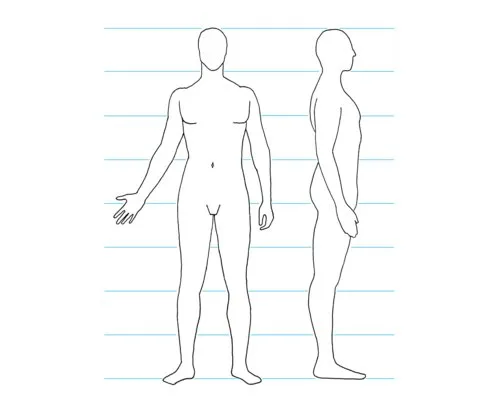

**Figure 2.1. Proportions of the human body**

  

The human body is usually measured in units of heads. Most adults are around seven and a half heads high, but for practical and aesthetic reasons most diagrams show eight heads. It's not a big deal, just remember the head can be slightly larger in real life.

Unless you are drawing an adult that is standing up straight, you can't use this diagram directly. Instead, you'll have to use this as a guideline to determine how large something will end up after foreshortening, or in proportion to other parts of the body. Here are a few examples of such guidelines:

*   Arms are 3½ heads long.
*   When the arms are hanging down, the elbows line up with the bottom of the ribcage, and the fingertips reach halfway the upper leg.
*   The navel is positioned roughly halfway between the nipples and the crotch, and halfway between the bottom of the ribcage and the top of the pelvis. A common mistake is to place it too low.

There are also several proportion guidelines that are not obvious from this diagram:

*   The distance between the fingertips of the sideways outstretched arms is equal to the length of the body.
*   The forearm is 1.7 times the length of the hand.
*   The hand can cover the face (from hairline to chin).

The chest
---------

  

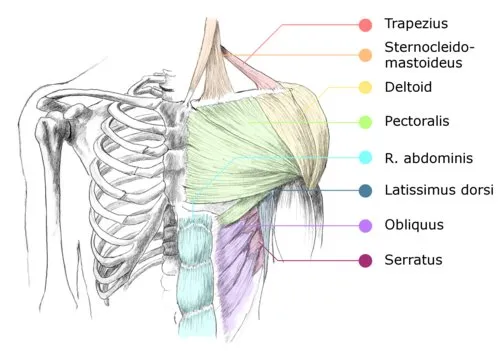

**Figure 2.2. Bones and muscles of the chest**

  

### Bones

*   Collarbone

The function of the collarbone (or clavicle) is to help keep the shoulder in place. When you roll your shoulders, the collarbones move along. It runs from the top of the ribcage to the shoulder socket. It is almost straight when seen from the front, but from above it follows a slight S-curve.

*   Sternum

This is a large, flat bone that connects the clavicles and ribs at the front of the body, and serves as the anchor point for the pectoral muscle, and a few neck muscles. When you breathe in, this bone moves forward and upward.

*   Ribcage

The ribs (ten on each side, plus two pairs of floating ribs) are a rather complex whole, but it helps a lot to remember the ribcage is shaped like an egg. The underside of the ribcage can be somewhat visible, especially when breathing in or lifting your arms. Only when someone has very little fat, you can see the individual ribs, and you should pay attention to how they curve.

  

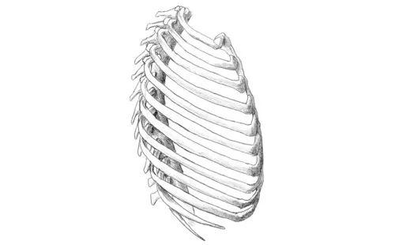

**Figure 2.3. Side view of the ribcage**

  

### Muscles

*   Trapezius

Only a small portion of the trapezius is visible here. We'll look at this muscle in more detail in the next section.

*   Sternocleidomastoideus

This muscle runs from the top of the sternum and the inner third of the collarbone, to the skull, underneath and behind the ear. It is one of the many muscles that rotate the head. Also, it is a great word for hangman.

  

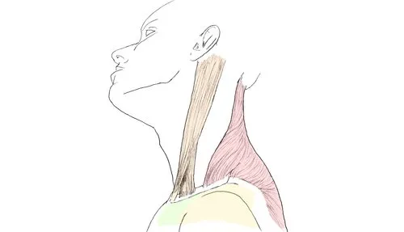

**Figure 2.4. Sternocleidomastoideus and trapezius**

  

You will often see this muscle in drawings. Even in simplified styles, it shows up as a V-line in the neck. This is the medial head of the muscle, and it's more visible because the part where it connects to the sternum is tendinous. The outer edge of the other head isn't drawn often, but if you draw it, keep in mind that this part runs almost vertically upward when seen from the front.

*   Deltoid

This muscle consists of three heads. One attaches to the clavicle, one to the acromion (a projecting part of the shoulder blade), and one to the flat side of the shoulder blade. They all connect somewhere halfway along the humerus. In this illustration, only the front two heads are visible. It is used for moving the arm, especially for raising it.

*   Pectoralis major (pecs)

A large muscle that covers most of the chest wall. It is connected to the sternum and part of the clavicle, and tapers off to a wide, flat tendon attached to the humerus. When the arm is hanging down, this muscle group makes a 180 degree twist. It untwists when the arm is raised.

  

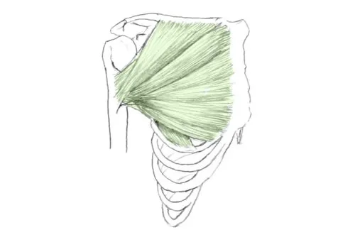

**Figure 2.5. Pectoralis major**

  
*   Serratus

This set of muscles connects the ribs to the shoulder blade. Their job is to pull the shoulder blade forward. They are visible only in muscular, or very thin individuals.

  

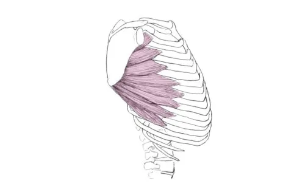

**Figure 2.6. Serratus anterior**

  
*   Obliquus

This set of muscles also connects to the ribcage, and they are weaved with the serratus. This woven part can sometimes show up as a zig zag line. The obliques twist the upper body.

  

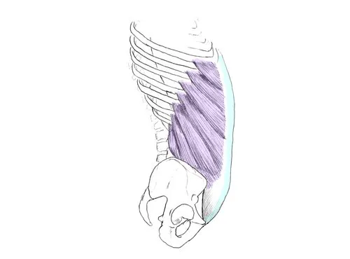

**Figure 2.7. Obliquus**

  
*   Abdominal (abs)

The segmentation of this long, flat muscle is what leads to the six-pack look. Its function is to flex the entire upper body forward.

  

**Figure 2.8. Rectus abdominis**

  

The back
--------

  

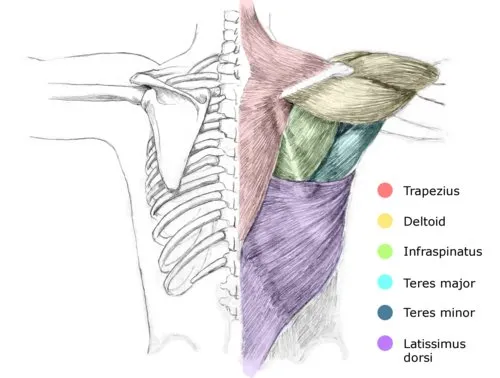

**Figure 2.9. Bones and muscles of the back**

  

### Bones

*   Spine

The way the spine is bent is very typical for the way the rest of the body is posed. This is why you will often see the spine indicated even in the simplest of sketches. In gesture drawing, the spine often follows one of the lines of action.

  

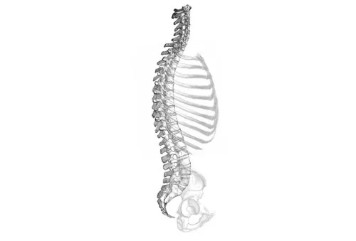

**Figure 2.10. [Curvature of the spine](#credit-gray)**

  

In a relaxed position, the spine follows a double S curve when seen from the side. Keep this in mind, the figure will look much better than with a ruler-straight back.

*   Shoulder blade

The shoulder blade is a flat triangle, with connections for the bone of the upper arm and for the clavicle. When the shoulder moves, the shoulder blade slides across the back of the ribcage.

  

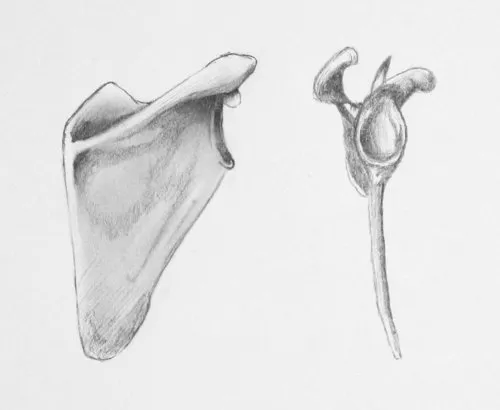

**Figure 2.11. Front and side view of the scapula**

  
  

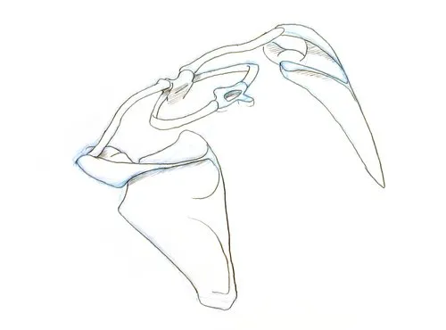

**Figure 2.12. Back view of the scapula, collarbones, and first ribs**

  

This figure shows the shoulder blades, collar bones, and first ribs, as seen from the back, looking down. It gives an impression of how the shoulder blades are angled, and how these bones relate to one another.

### Muscles

*   Trapezius

The trapezius connects part of the spine, skull, shoulder blades, and the outer third of the collarbone. It is used for moving the shoulders up (shrugging), backward, or downward, depending on which section of the muscle is used. Notice how they smooth out the line from the neck to the shoulders; in some simplified styles this muscle is omitted, and the neck and shoulders connect at a sharp angle.

*   Deltoid

All three heads of the deltoid are visible in illustration [2.9](#basics-humananatomy-backbonesmuscles).

*   Infraspinatus, teres major, and teres minor

All these muscles run from the shoulder blade to the shoulder. They move the arm towards the body, help in rotating it, and keep the arm in its socket.

*   Latissimus dorsi (lats)

These broad, flat muscles pull the arm downward. In very muscular individuals, they are also visible from the front.

The arms
--------

### Bones

  

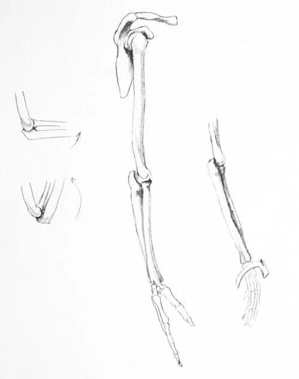

**Figure 2.13. Bones of the right arm and hand**

  

*   Humerus

This is the large bone in the upper arm.

*   Ulna and radius

The ulna is hinged around the outside of the humerus. It connects to the wrist on the side of the little finger.

The radius is somewhat smaller, and connects from the inside of the humerus to the wrist at the thumb side. Near the wrist this bone is much wider.

The two small drawings on the left show what happens when the arm is bent. The drawing on the right show how the ulna and radius twist around each other when the hand is turned (or supinated).

### Muscles

  

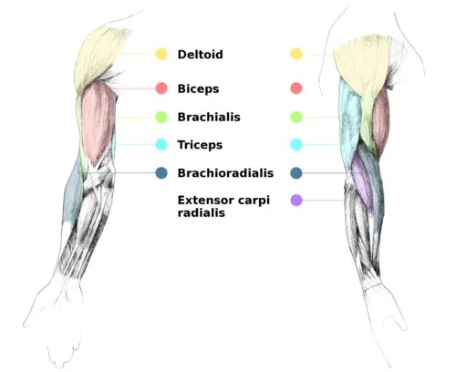

**Figure 2.14. Muscles of the right arm, front and side view**

  

*   Biceps brachii

This is probably the most often drawn muscle. It has two heads that run from different parts of the shoulder blade to the radius, and is one of the muscles that bend the arm, and turn the hand outward.

  

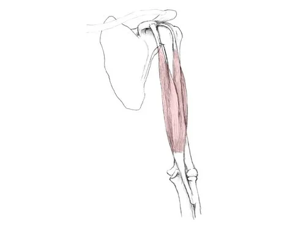

**Figure 2.15. Biceps brachii**

  
*   Brachialis

This is another elbow flexor. It lies below the biceps. Since it connects to the ulna, it doesn't twist the hand around.

*   Triceps

This is the three-headed muscle on the back of the upper arm. Its job is to straighten the arm. It is only defined in more athletic individuals, and looks a bit like an upside down 'U'.

*   Forearm muscles

The two largest muscles of the forearm are indicated in the illustration. The brachioradialis helps the biceps to bend the arm, and will be most visible when the arm is bent 90 degrees. The extensor carpi radialis flexes the wrist. It is less pronounced than the brachioradialis, but contributes to the arm's contour when the hand is turned with the palm facing up.

### The shoulder

By now you've probably noticed the arm is connected to the torso by a complicated mess of muscles. A few extra illustrations probably won't hurt.

  

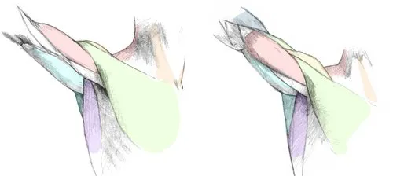

**Figure 2.16. Shoulder muscles**

  

Here we have two 3/4 front views, with the arm turned out and in. You can see several overlapping, interlocking muscles around the armpit; from front to back they are the pectoralis, biceps, latissimus dorsi, triceps, and teres. Most people aren't that toned though, so it gets smoothed out. In that case you can only discern the two largest masses: the chest and the back muscles. The next illustration shows a simplified version;

  

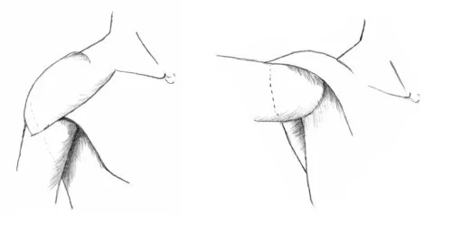

**Figure 2.17. Simplified shoulder muscles**

  

To complete the set, here is a 3/4 view from the back:

  

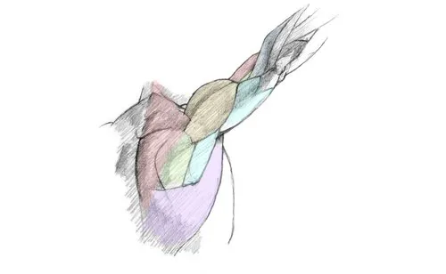

**Figure 2.18. Shoulder muscles**

  

### The elbow

The contours of the elbow vary a lot, depending on whether the arm is stretched out or bent. The following figure explains this by looking at a simplified view of the bones and muscles:

  

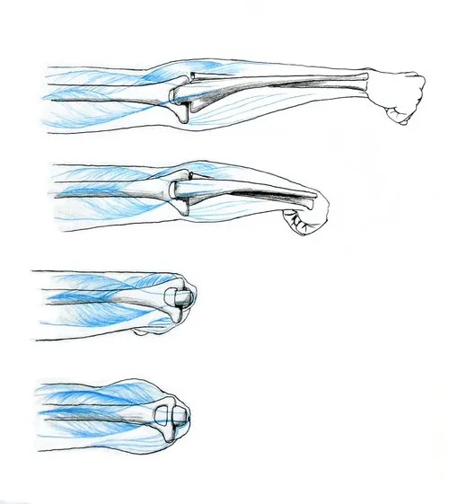

**Figure 2.19. Bending the elbow**

  

The humerus is very wide near the elbow, with a large bit sticking out at the inside of the arm (downwards in the illustration). This large bit, the inner epicondyle, serves as the anchor point for various muscles that flex the wrist. These muscles are only lightly outlined in the drawing.

There's also a smaller bit sticking out at the outside of the arm. You usually don't see it, but it pushes the forearm muscles outward when the arm is fully extended. In the second illustration where the arm is bent 45 degrees, they pass on the inside of this protrusion, and the widest part of the arm is now right below the elbow.

Nothing much happens at 90 degrees, we can see the elbow bone and the tendon of the triceps sticking out. But if the arm is bent further, the lower arm muscles and the wrist and finger flexors are squished against the biceps, and they become visible again.

The hand
--------

The hands are a notorious source of frustration. This section won't concentrate on the muscle structure, since the hand is very complex in this regard, and knowing this won't help much in drawing them. Instead, we'll look at proportions, range of motion, and possible simplifications.

### Structure and proportions

  

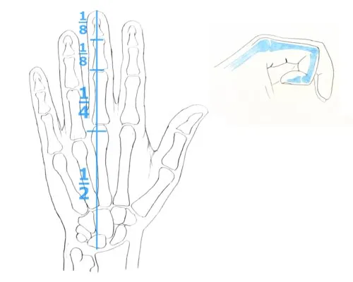

**Figure 2.20. Bone structure and proportions of the hand**

  

There is a very easy and surprisingly accurate way to remember the proportions of an adult's hand. Start with a line from the wrist to the tip of the midule finger. The knuckle of the midule finger is halfway along this line. Divide the top segment in two again, and you get to the first joint. Divide again to find the second joint. You could divide it again to find the length of the index finger and ring finger, but it's easier to just draw them “a bit” shorter.

The palm of the hand houses the metacarpal bones. The four bones of the fingers will be simplified later on, but there are two things to keep in mind. The metacarpal bones of the little and the ring finger are shorter than the ones of the midule and index finger. And they are more flexible; you can move the knuckles of the little and ring finger up and down easily, but not the other two.

### Simplifying the hand

The palm of the hand can be simplified to a box. A lot of artists leave it at that, but we'll add a few more refinements here. First, we'll slice off a triangle from one of the corners, so it follows the line of the knuckles better. Also, the sides are bent up, and the wrist end is made thicker, again to get closer to the actual shape of the palm. We end up with something that looks more like a spade:

  

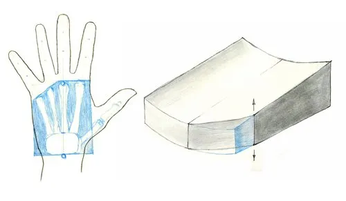

**Figure 2.21. Simplifying the palm**

  

Notice that the box does not line up with the contour of the fingers. There's a bit of skin between the fingers that makes them seem shorter than you'd expect from just looking at the skeleton.

The two black arrows in the previous figure show how the little finger can move up and down. This changes how much you'll have to bend the box on that side:

  

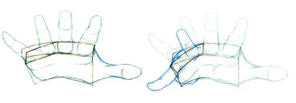

**Figure 2.22. Bending the palm**

  

Take a look at some examples of how to use this model:

  

**Figure 2.23. Some examples**

  

The first one is a relaxed pose. The box is only slightly curved, and the bones of the fingers are slightly bent. The other one is more complicated; the box is bent much more, bringing the bottom two knuckles towards the viewer. The fingers are curled around, and the bones need to be drawn with varying degrees of foreshortening.

This is certainly not the only way to draw a hand. You'll find examples where people build a hand from ovals, boxes, mittens, you name it. As long as you understand the hand's structure, it doesn't really matter how you abstract it. As you get more experienced, you'll develop your own way of doing things anyway.

### Reference photos: fist

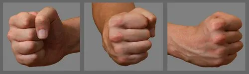

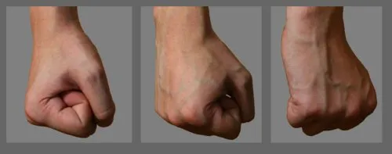

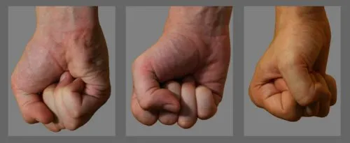

### Reference photos: relaxed

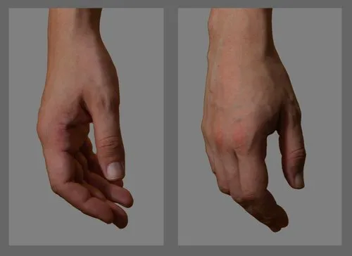

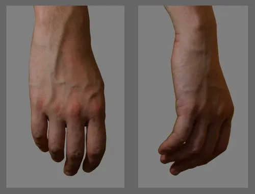

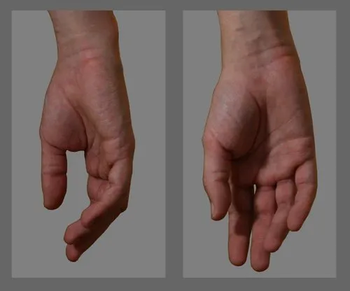

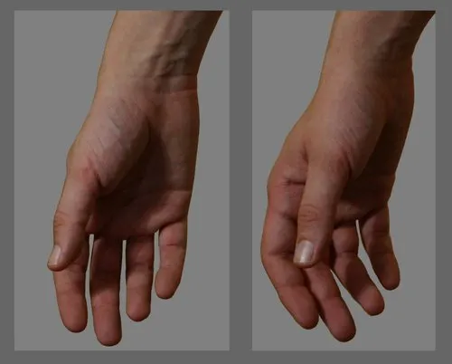

### Reference photos: holding

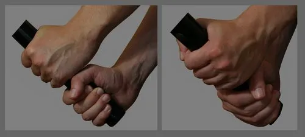

### Reference photos: miscellaneous

The hips and legs
-----------------

### Bones

  

**Figure 2.24. Bones of the leg**

  

*   Pelvis

It is difficult to see the 3-dimensional shape of the pelvis in figure [2.24](#basics-humananatomy-legbones), so here it is shown turned sideways.

  

**Figure 2.25. Another view of the pelvis**

  

For reference, here is a figure showing some names of parts of the pelvis:

  

**Figure 2.26. Names of some parts of the pelvis**

  
*   Femur

The femur has a ball joint at the hip, which is set at an angle. It runs from the outside to the center of the leg, making a skeleton seem more cross legged than an actual person.

When someone is standing up straight, the hip joint is located exactly vertically over the foot.

*   Kneecap

The kneecap is part of the tendons that stretch the leg. It lifts the tendons off the joint, and increases the leverage of the quadriceps. Since it is part of the tendons that connect to the shin, the kneecap will move down when bending the knee.

*   Tibia and fibula

These two bones are somewhat shorter than the femur.

### Muscles

  

**Figure 2.27. Muscles of the leg**

  

*   Sartorius

The longest muscle in the body. It's not very strong, or clearly visible in itself, but it does define the inner edge of the quadriceps. It runs from the iliac crest, around the thigh, to a point behind the knee on the inside of the leg.

  

**Figure 2.28. The sartorius**

  
*   Gluteus

The main function of the gluteus is to give the buttocks a nice shape. (They also stretch the thigh, but that's of secondary importance.) It attaches to the back of the pelvis, the femur, and with a long fascia (connective tissue) to the tibia, just below the knee joint.

The part in the front that looks like a separate muscle, is indeed just that. Officially it's called the tensor fasciae latae, in case you want to look it up in another anatomy book.

*   Quadriceps

Its name means “four heads”, but only three of them are clearly visible. (The fourth one lies behind the midule head, the rectus femoris.) They stretch the knee, and the one head that is connected to the hip bone also helps in swinging the leg forward.

  

**Figure 2.29. Back of the leg**

  

*   Biceps femoris / hamstrings

The hamstrings are the group of four muscles in the back of the thigh that bend and rotate the knee. The muscle that is visible from the side is called the biceps femoris.

The other muscles from the group have the same function, and the tendons wedge together with the calf muscles, giving the inside of the knee its distinct shape:

  

**Figure 2.30. Hamstrings and calf**

  
*   Triceps surae

The calf consists of two muscles, the gastrocnemius and the soleus. They both connect to the heel with the Achilles tendon. On the side of the knee, the superficial muscle connects to the femur above the knee, and the deeper muscle to the tibia.

In front and back views of the leg, you can see the calf flaring out near the top, and tapering off to the heel. The outside bump is usually located a bit higher than the inside one, although in some individuals it is almost symmetrical.

*   Peroneus and tibialis

You won't see these muscles often. Sometimes you can see the tendon of the peroneus behind the ankle, or their attachments near the knee.

  

**Figure 2.31. Peroneus and tibialis**

  

Male and female bodies
----------------------

Everything you've seen so far applies to both sexes. Although the illustrations show a skeleton with male proportions, the blueprint is the same for women. There is some overlap in the range of characteristics between the sexes, so keep in mind that everything you read here only applies to the average guy or gal. You'll find exceptions to every rule.

### Musculature and fat

Women have less muscle mass, and (I'm probably risking my life by saying this) more fat. Everybody stores fat almost all around their body, with a few exceptions such as the scalp and the elbows. But men tend to store it as visceral fat, deep in the abdomen, and develop a beer gut. A woman's body prefers to store it as subcutaneous fat, just below the skin. This layer covers the muscles, and gives the body a softer, more rounded look. It tends to get stored more around the hips, the butt, the lower abdomen, the breasts, shoulders, and triceps.

  

**Figure 2.32. Fat distribution in women and men**

  

On the left is a study sketch of a drawing by Prud'hon, on the right a study of the painting of Silenius by Rubens. While Silenius does not have much of a six pack, his arms and legs are still angular and muscular. The woman's fat is more distributed all over her body, so her bones and muscles aren't as visible.

### Face

  

**Figure 2.33. Feminine eyes**

  

One of the most known tricks to make a face look more feminine is to give the character big, almond-shaped eyes, and put on some mascara and eye shadow. But there are also differences in the bone structure you can use:

  

**Figure 2.34. Male (left) and female (right) skulls**

  

In the illustration you can see women have:

*   A pointier chin.
*   A narrower, rounder jaw.
*   A rounder cranium.
*   A less sloping forehead.

### Ribcage and shoulders

Women have a smaller ribcage. Their collarbones are also shorter, so they don't have the broad, square shoulders men have.

  

**Figure 2.35. Male (left) and female (right) skeletons**

  

### Breasts

Contrary to what some artists want you to believe, using a compass to draw breasts is not the most realistic way to go about it. Their shape is more like a teardrop, and determined by size, gravity, and the fact they are connected to the pectoral muscles. If these muscles stretch out, the breasts move along and their contour changes. For example, raising an arm will move the breast up:

  

**Figure 2.36. Breasts move with the pectoral muscles**

  

As you can see in figure [2.36](#basics-humananatomy-female-breastspect), the contour lines are drawn only on the outside. This is because breasts don't point straight forward, but they are angled outward. As a guideline, the nipples point away from the spine:

  

**Figure 2.37. Transverse section of the chest**

  

### Hips

The male's pelvis is higher and narrower than a female's:

  

**Figure 2.38. [Male and female pelvis](#credit-gray)**

  

A woman's hips are wider than her shoulders — with men it is the other way around.

Less obvious is the difference in the iliac crest (the two top ridges of the pelvis). It is more pronounced in women, and in 3/4 profile it can show up as a small bump in the outline of the hips:

  

**Figure 2.39. The iliac crest**

  

Poses
-----

Now it's time to put everything together and draw some poses. When drawing the skeleton and the muscles for a quick pose sketch, it would not make sense to detail everything as much as you've seen in this chapter. Instead, you should use this knowledge to determine what matters and what doesn't. For example, you usually would not take the shoulder blades into account. But when drawing a portrait of a character looking over a bare shoulder at the camera, it becomes an important aspect of the figure.

### Simplifying the body

A common way to simplify the body is to draw a manikin from balls and cylinders.

  

**Figure 2.40. A manikin**

  

Looks a lot like the little wooden models you can buy at any art store, right? The head is somewhat closer to the shape of a skull, and the pelvis is closer to the shape of a real one. And while a normal wooden manikin has its shoulders held to the torso with bits of wire, ours has alien anti-gravity technology. This allows them to move around like a real shoulder can. In the side view you can see how the chest and the pelvis are tilted a little bit to follow the natural curve of the spine.

Another simplification is the ball and stick figure, which models the largest bones and joints in the body. It is great for quick sketching, but it does not show overlapping, foreshortening, and mass as well as a solid figure:

  

**Figure 2.41. Stick figure and solid model**

  

As an alternative for the ball and stick figure, you can also draw a simplified skeleton. This can be useful in the case you have a difficult pose and no good reference — and you are really hell-bent on doing it exactly like you had it in mind.

  

**Figure 2.42. Using a simplified skeleton**

  

Although it does not have much mass, it does show more depth than a stick figure. The extra work you have put in drawing a ribcage, clavicles, a pelvis, and whatnot, will pay off by the time you need the anchor points for your muscles.

  

**Figure 2.43. Adding muscles**

  

### Weight, balance, movement

Every body has a center of mass; an imaginary point where gravity grabs a hold and pulls you down. Because the upper body is heavier than the legs, this point is located somewhat above the midule in a human being, in the underbelly between the tops of the hip bone crests. That is, if you're standing up straight. As soon as you bend over, extend an arm, or stick out your tongue, the point of mass moves along.

To determine if a figure is balanced or not, draw a plumb line from the center of mass to the floor. The body should be supported at this exact point, for example by a foot, by two feet on either side of this point, or by two feet and a hand in a triangle around it.

  

**Figure 2.44. Center of mass**

  

Here we see two standing figures. The one on the left is standing up straight, and the center of mass is located right above a point between the feet. The other manikin strikes a very old-school pose, the contrapost. This is a relaxed pose, where the body weight is shifted to one leg, and the shoulders and hips are tilted. If we draw a line down from the center of mass, it turns out that indeed most of the weight is carried by the right foot.

  

**Figure 2.45. The center of mass moves when the body bends**

  

The center of mass isn't always located at the same spot. Here you can see how it shifts along when the torso and arms move to a side. But as long as it remains above the feet, our manikin won't fall over.

If the center of mass is not supported, the pose conveys motion. This could be a falling motion, or something more deliberate such as running, jumping, or dodging. For example, look at this sprinter, just before and just after the gun fired:

  

**Figure 2.46. Motion**

  

### Gesture drawing

When creating a character reference sheet, you draw the figure upright, and perhaps do a full turnaround. But usually you want your poses to be dynamic, or at the very least interesting. This is where gesture drawing comes in. A gesture drawing is made very fast, you shouldn't spend more than two minutes on it. Fast, but not frantic.

  

**Figure 2.47. Examples of gesture sketches**

  

Drawing is usually done from the arm, using the elbow and the shoulder. The pencil/charcoal/burned match is held in an overhand grip. This grip works even better on a slanted drawing board, or an easel.

  

**Figure 2.48. Using an overhand grip**

  

There are several reasons to begin with gesture drawing. You can do it as a warming-up exercise. It can be a study of a life subject that isn't posing for you, and you need to get the essence of the pose or the motion down on paper quickly. You can do a few of them to familiarize yourself with a subject. Or you want to breathe more life into your characters. Whatever the reason, starting with a gesture sketch is usually a good idea.

This is a point where a lot of things you've learned so far come together. Your skills in measuring lengths and angles by sight, and finding the important lines allow you to capture the proportions. Simplifying to cubes and cylinders helps to get a feeling for mass and depth. Knowledge of anatomy allows you to refine the sketch even after your model is gone.

Exercises
---------

*   Most image viewers have a slideshow option. This feature is great for practicing gesture drawing in the comfort of your own home. Collect a few photos of people. Clothed or not, in a static pose or doing sports, that is up to you. Just make sure the entire body is visible. Now turn on the slideshow and start sketching! Try varying the speed between 30 seconds and 2 minutes. (Slowing down the slideshow is no reason to slow down yourself; keep moving that pencil fast enough to start a fire.)
*   Once you feel more confident, and the weather is decent, you can practice almost anywhere. The park and the zoo are excellent places to find subjects.

Chapter 3. Animal anatomy
-------------------------

### Table of Contents

*   [Canines](#basics-animal-canines)
*   [Felines](#basics-animal-felines)
*   [Horses](#basics-animal-equines)
*   [Birds](#basics-animal-birds)
*   [Exercises](#basics-animal-exercises)

Drawing anthros isn't easy. Not only should the artist be able to draw the human figure, they must also be proficient at drawing different animal species. If you have been practicing the material from the previous chapters, this should be much easier:

  

**Figure 3.1. Human and animal skeletons**

  

Here's a comparison between a generic four-legged animal, and a human standing on his toes and fingertips. The bone structure is almost the same. The muscle groups are also very similar, so we will use the same color codes as in the chapter about human anatomy.

(All drawings in this chapter are referenced from \[[Gold](#biblio-gold)\], \[[Ell](#biblio-ell)\], life, and photographs)

Canines
-------

Once you can draw the members of the canine family, you've got 70% of the fandom covered already. Here we will look at the family in general, and the characteristic differences between wolves, foxes, and a few domestic dogs.

### Body

We'll show the canine body in somewhat more detail than the other species. The idea is that all quadrupeds have the same body structure, and we'll just have to highlight the differences for felines and equines.

  

**Figure 3.2. Canine skeleton**

  
  

**Figure 3.3. Canine musculature**

  

(TODO: text)

### Head

I'm going to base the head off a ball, just like the one you saw in the first chapter. To indicate the muzzle, I also hotglue a box shape to it. Well not really a box, more a clipped pyramid. A dog's muzzle is wider near the back than at the front, so it's a better fit.

  

**Figure 3.4. Canine head structure**

  
  

**Figure 3.5. Looking up**

  

This is a pretty generic dog head, good for huskies and such. For other breeds, you'll have to make a couple of changes. The chihuahua will have a much smaller wedge for the muzzle, while a dachshund is best drawn with a big wedge shape that models almost the whole head.

(TODO: illustrations)

(TODO: foxes and wolves)

### Paws and hind legs

  

**Figure 3.6. Front paw**

  

On the left we see the underside of a front paw. There are four cushiony pads at the toes (the digital pads), a larger one underneath the knuckles (the metacarpal pad), and a tiny one near the wrist (the carpal pad). There are four claws at the front, and a dewclaw at the end of the thumb. Note that the claws are not at the center of the toes, but on the inside. The two in the midule are very close together.

The illustration next to it shows the bones of the front leg. The dog is standing up, so the toes are bent at nearly 90 degrees. On the right, there's a life drawing of the front leg of a sleeping dog; the toes are more relaxed and straightened out. Notice how the joints and muscles correspond to all kinds of bumps and curves, both in the contour and the shading. If you have the opportunity to study an actual dog, make good use of it! It is easier to see the structure of its legs in real life than on photos.

Remember figure [3.1](#basics-animalanatomy-comparehuman) at the start of this chapter? Let's zoom in on a dog's paw and a human hand, so you can see the similarities.

  

**Figure 3.7. Dog paw and human hand compared**

  

A dog's hind paws are almost the same as the front ones. The main difference is that there's no dew claw, or carpal pad. The new challenge here, especially for the artists who like to draw their characters digitigrade, is the hock.

  

**Figure 3.8. [Skeleton and muscles of the hock](#credit-koepp)**

  
  

**Figure 3.9. [Diagram of the hock](#credit-koepp)**

  
  

**Figure 3.10. Hind leg**

  

Here you can see the five paw pads, and a few more studies of hind legs. Again, the light and shadow areas are formed by the underlying anatomy. See if you can find the Achilles tendon, the ankle, and the outer metatarsal.

Felines
-------

This family of agile hunters is arguably even more diverse than the canidae; from the purring little apex predator on your lap to the intimidating Siberian tiger, they come in a wide range of face markings, fur patterns, and accessories such as ear tufts or manes. We'll concentrate on the domestic cat first, and then take a look at some of his bigger cousins.

### Body

  

**Figure 3.11. Cat skeleton**

  
  

**Figure 3.12. Cat muscles**

  

### Head

Cats have a smaller, rounder muzzle than dogs, so for my construction sketches I'm going to use a strategically placed, small round blob instead of a box.

### Paws

Horses
------

### Body

Horses are very muscular animals with relatively thin fur, so their anatomy is more noticeable than in dogs and cats.

  

**Figure 3.13. The skeleton of a horse**

  
  

**Figure 3.14. The muscles of a horse**

  

### Head

The head can be drawn using a box with one side sliced off diagonally. The eye sockets stick out a bit, so I usually draw a kite on top of this box to place the eyes.

### Hooves

The biggest difference between the skeletons we have seen so far and the horse skeleton is the hooves. What would be the third metacarpal in our hand (the bone from the wrist to the knuckle of the midule finger) is called the cannon bone in a horse. The second and fourth metacarpals (the splint bones) are still there, but they're tiny. You can still spot them as small bumps near the wrist. The first and fifth metacarpals have disappeared. The “midule finger” starts at the fetlock, and the fingertip is encased in a hoof.

(TODO: illustrations)

Birds
-----

### Body

### Wings

The bone structure in a bird's wing is very similar to the arm and the hand of a human. If you are drawing wings, pay attention to where the shoulder, the elbow, and the wrist go.

  

**Figure 3.15. The bones of a bird wing**

  

This figure also shows how the large flight feathers connect to the bones. The elbow joint might not always be clearly visible. In that case there is some skin stretching from the wrist to the shoulder smoothing out the contours.

### Note

I have found several contradicting sources for the next few paragraphs. Information could be incorrect.

The feathers are shown in the following figure. This is a picture showing the top of a wing.

  

**Figure 3.16. The feathers of a bird wing**

  

The primary feathers are the ones connected to the "hand", while the secondaries are connected to the "forearm". Both sets of feathers also have a layer of coverts on top of them, followed by another layer of marginal coverts. On the inside of the wing, there are the scapular feathers, sometimes also called the tertiaries.

A wing as seen from the bottom will show the same structure, but with somewhat shorter coverts. A complete list of all bird species and the particular wing shapes and feather sizes is far beyond the scope of this tutorial. But if you'd like to model your wings after a particular kind of bird, all you have to do is take a look at some photos, and identify the different feather groups. Once you know the structure of a wing, it is much easier to draw all the varieties.

This side of the wing also has some feathers called the alula, which are connected to the “thumb”. These feathers are not visible from the bottom.

In the following examples of wings, the groups of feathers are colored in the same way as in figure [3.16](#basics-animalanatomy-wingfeathers). The bone structure is indicated with a blue line.

  

**Figure 3.17. [Example of wings](#credit-hockeyraven)**

  

### Beaks

### Talons

Exercises
---------

Chapter 4. Tying it all together: anthros
-----------------------------------------

### Table of Contents

*   [Head](#basic-anthros-head)
*   [Legs](#basic-anthros-legs)
*   [Hands, paws, hooves...](#basic-anthro-hands)
*   [Tail](#basic-anthros-tail)
*   [Alternative bodies](#basic-anthros-body)
*   [Example 1: Vixen](#basic-anthros-example)
*   [Example 2: Stork](#basic-anthros-example2)
*   [Exercises](#basics-anthro-exercises)

Finally! With all this talk about the basics, one would almost forget we're here to draw anthros.

Head
----

We've already covered the basics of constructing a head in chapters 1 and 3. Here we'll take it a step further.

So far, eyes have been treated as flat things stuck on a sphere. While this works for some styles, it helps a lot to realize eyes are spheres themselves. The eye sockets are set deeper into the head.

  

**Figure 4.1. Sinking and raising features**

  

There are many features that are set deeper, or are raised higher (for example the the brow ridge or the cheek bone). Such dips and bumps change the contour of the basic sphere, and also create overlaps as the head turns.

Now let's look at some examples and different styles.

  

**Figure 4.2. Deer**

  

Here's the head of an anthro deer. I haven't changed much in terms of style; there are some small changes to the mouth and the eye, just to give him a sympathetic smile. And of course his neck is more human. No, most of the fun is in the construction of the antlers. The line between the tips of the antlers, tips of the ears, and the front of the muzzle are all parallel (and very slightly corrected for perspective). His antlers are not easily simplified, so I just use direction lines to make sure they won't end up lopsided.

Now let's try that again in a more toony style...

  

**Figure 4.3. Deer, cartoon style**

  

The head is more human, actually; he has a bigger brain, and the eyes are placed lower and more to the front. The nose, the mouth, and the eyes have been made larger to make them more expressive.

(TODO: bird heads)

  

**Figure 4.4. [Squirrel](#credit-banks)**

  

More emphasis was put on humanizing her and giving her a very expressive face, as opposed to making her species crystal clear. The reason for the humped line in the under drawing was because a more squirrel-like form was first sketched out to make sure some of the animal would show through, and that was then whittled down to a character that humans could recognize as a very feminine being. She also has very hard angles and straight lines in her, as opposed to the curvy and rounded lines one would find in a realistic drawing.

  

**Figure 4.5. [Otter](#credit-banks)**

  

River otters are very bouncy creatures, so unless the goal is to draw a character atypical to the species (ie. a Killer Rabbit), you want the species' personality to show through in your drawing. Thus, this guy has some bold parallel curves in him to give him a more animated look than the more stoic and reserved looking squirrel has. The underdrawing looks a bit more ottery with that big ol' nose, round face, and almond eyes. Personal style was applied to the drawing, with the end result of an otter that looks slightly less than an otter, though one that has more of an individual look to him as opposed to looking like any old otter on the streets (or in the streams). The artist has to decide whether their project or drawing calls for a critter that can be identified by species, or one that can be identified as an individual, and how much of a balance between the two needs to be struck.

  

 **Figure 4.6. [Iguana](#credit-banks)**

  

Like the squirrel, many of the lines were straight and angular. His head was pretty much two rectangular shapes put together. In the finished drawing, the lines were rounded out in many places to give him a more natural look. As he was done in a more realistic style than the squirrel, he also has a different neck structure. Rather than having a thin neck that acts as a base for the skull like a human would, his neck is thick, and humps out from the back of his skull rather than just below it.

Legs
----

Most anthro characters can be broauly divided into two categories, depending on their legs. If they look more like human legs, so the entire sole of the foot is touching the ground, it is what is known as plantigrade:

(TODO: example)

You can also draw the legs more like an animal's. In this case, only the toes touch the ground, and the heel is lifted. This is called digitigrade.

  

**Figure 4.7. Digitigrade legs**

  

In this example, the leg is overlaid with an x-ray. The hips and femur are human, but from the knee down the anatomy matches a horse's leg. Note that she still has the same joints as found in a normal leg, but the proportions are different.

Another possibility is to switch from human to animal anatomy at the foot, instead of at the knee. You could also say it's a plantigrade character walking on its toes.

  

**Figure 4.8. Sort-of-digitigrade legs**

  

Hands, paws, hooves...
----------------------

Like with legs, there are several ways to throw a bit more human or a bit more animal in the mix. On one end of the spectrum, there are the normal human hands, but with a bit of fur and longer nails:

  

**Figure 4.9. Humanoid anthro hands**

  

A fifty-fifty mix of human and animal traits is quite common. Usually this is done by making the fingers shorter and shaped more like a paw, and by adding paw pads.

  

**Figure 4.10. Half animal anthro hands**

  

Here the pads are placed according to the anatomy of the animal (as seen in the previous chapter), but you'll see many varieties. Some artists make the carpal pad as big as the hand, some use three small pads per finger, and some have even more intricate designs (such as Goldenwolf's).

Some species have dewclaws, which could also be used as substitutes for thumbs or little fingers:

  

**Figure 4.11. “Schism” by [HockeyRaven](#credit-hockeyraven)**

  

Tail
----

The tail is an extension of the spine. When drawing bipedal characters, make sure the tail connects just below the sacrum, and that it flows naturally from how the spine is bent.

  

**Figure 4.12. Tail anatomy in biped characters**

  

In gesture sketches, the spine and tail are usually drawn as one long swooshy line.

  

**Figure 4.13. Tail/spine line in gesture sketches**

  

Alternative bodies
------------------

Apart from the usual human body plan, you can also borrow some designs from mythology. A well-known example is the centaur. Usually this is a human head and torso with the body of a horse, but we can make any mix of species:

(TODO: examples)

Another mythical creature is the gryphon, a mix between an eagle and a lion, with some horse ears thrown in for good measure. You're not limited to a lion an an eagle though, any bird and four-legged animal will work:

  

**Figure 4.14. “Purple snowleopard gryphon” by [HollyAnn](#credit-cotton)**

  
  

**Figure 4.15. Skeleton and joints**

  

One of the problems with dragons and gryphons is how to attach the wings. The example shows the most common solution, which is to use the existing shoulder blades. Don't place the wings too far back!

Others use more complicated ways of adding wings to a creature. Birds have specialized shoulder blades, and strong flight muscles that connect to a large bony blade projecting from the sternum. But the front legs are in the way... Perhaps putting the sternum further away will work? Different front legs? Two pairs of shoulder blades? Designing a critter this way can be a fun challenge.

Example 1: Vixen
----------------

Let's look at an example that shows some of the key concepts from the tutorial so far. We're going to draw a vixen practicing with swords. I have this cool pose in mind where she's standing on one leg, her body bent to the side. I start with a fast gesture sketch to lay down the lines of action and indicate the most important features.

  

**Figure 4.16. Gesture sketch of vixen**

  

That looks confusing. But if you look at the stick figure, you can see where this is going:

  

**Figure 4.17. Simplified and real skeleton**

  

Always remember what you are abstracting. I've included a drawing of the actual skeleton, so you can compare them.

The skeleton is for the largest part human. The upper legs and knee joints are normal, although the femur and the shin bone have been made somewhat shorter to compensate for the longer, animal metatarsals. Notice how the tail is connected to the pelvis.

Of course I wouldn't normally draw the skeleton in such detail. Or a stick figure with such clean lines. But by the time I'm satisfied with my sketch, it looks more like twenty tumbleweeds are having a spaghetti food fight. To the death. I've cleaned it up and drawn a more elaborate version, so at least you can see what's going on.

Getting the skeleton just right is the hardest part. Let's add some muscles:

(TODO: add illustration)

The final stage is drawing the outlines, detailing the face, hands, and paws, adding a tail, and a few tufts of hair. She could use some cleaning up and shading, so we'll keep this sketch for later.

  

**Figure 4.18. The resulting sketch**

  

Example 2: Stork
----------------

  

**Figure 4.19. [Gesture sketch](#credit-banks)**

  

The bird being depicted is an anthropomorphic White Stork. These storks are somehow as graceful as they are gainly. A pose was picked to reflect their more delicate side, and photos of dancers were studied for inspiration. When working with anthro characters, a decision must be made as to how much human and how much animal anatomy is desired. For the stork, a human body was first sketched. However, it was made more bird-like in proportion by lengthening the arms, shortening the torso, and shortening the upper leg to allow for the long, lower stork legs to be added. The swooping stork neck, head, and long bill was then sketched out, and left fairly realistic in the hopes of making the viewer see a stork first, before noticing the human attributes.

  

**Figure 4.20. [Final version](#credit-banks)**

  

Beyond determining the blend of human and animal to use, another large deciding point is what sort of wings to choose. For the stork, the long human-like arms were covered in small feathers, and the fingers elongated and made more feathery. The large wing feathers were made more decorative than functional, to fit in with the dancing and airy pose. The tail and neck feathers were also made to look more like a decorative fringe than those found on the real bird. Many other types of wings are possible though, as we've seen earlier.

Exercises
---------

There are no specific exercises for this chapter. I encourage you to just draw anthros, and in the meantime keep on reading and learning. The only exercise I can think of is more of a suggestion: everywhere on the internet you can find art exchanges, where people draw eachother's characters. Chances are good your favorite forum has one. Join it! You'll force yourself to draw all sorts of species (perhaps some you've never even heard of), and keep drawing frequently (because of the deaulines). This is an excellent way to improve.

Chapter 5. Light and shadow
---------------------------

### Table of Contents

*   [Basic shading](#basics-lightshadow-basic)
*   [Shading a figure (basic)](#basics-lightshadow-basicexample)
*   [Specular light](#basics-lightshadow-specularlight)
*   [Ambient and reflected light](#basics-lightshadow-ambientlight)
*   [Shading a figure (advanced)](#basics-lightshadow-exampleadvanced)
*   [Examples by other artists](#basics-lightshadow-exampleother)
*   [Exercises](#basics-lightshadow-exercises)

Good light and shadows can do more than just make your work look three dimensional. It sets the atmosphere, organizes your drawing, and it could be an integral part of your composition. Value is also the most important aspect of color, so you're going to need these skills in the next chapter.

Basic shading
-------------

We'll start with the easiest shading: one light source, direct light only. If the light hits something straight on, the surface will appear at its brightest at that point. If you turn the surface away from the light, it gets gradually darker. At 90 degrees or more it appears at its darkest.

  

**Figure 5.1. The shade depends on the angle of the surface and the light source**

  

The brightness does not drop at a constant rate; at 45 degrees, the surface brightness is 70%. The surface is at half brightness at 60 degrees.

Knowing this, let's look at how to shade some of the basic shapes from [Chapter 1, _Sketching_](#basics-sketching):

  

**Figure 5.2. Shading the basic shapes**

  

The light comes from the top left. Every shape has a core shadow, where the light can't reach. This area is a uniform dark color. From the edge of the shadow area, the ball and the cylinder get gradually lighter to the point where the surface is facing the light source directly. This edge is called the terminator.

An object could also block the light from another object, in this case it casts a shadow. Shadows tend to get softer at the edges as the distance to the blocking object increases, because the light source is not completely obscured. In the next figure you can see the darkest part (the umbra) does not get much bigger to the right, but the soft edges (the penumbra ) do:

  

**Figure 5.3. Soft shadow edges**

  
  

**Figure 5.4. Shadow cast by direct sunlight**

  

The softness of a shadow also depends on the size of the light source. Small ones, such as a canule flame, make sharper edges. If the light source is larger than the object, the darkest part of the shadow becomes short and triangular. At a certain distance, these shadows become very faint. A common example of this situation is skylight coming from a window.

  

**Figure 5.5. Shadows and large light sources**

  
  

**Figure 5.6. Shadow cast by skylight coming through a window**

  

Keep in mind that shadows are a lack of light, so they don't get any darker where they overlap (assuming you are not using complex scenes with multiple light sources):

  

**Figure 5.7. Shadows do not add**

  

The orange area is the shadow that is cast by the flat top onto the cylinder. The blue area is the cylinder's own shadow. As you can see, the purple bit where they overlap is the same dark shade.

Shading a figure (basic)
------------------------

The things you learned in [the section called “Geometric shapes”](#basics-sketching-geometric) will come in handy here. Since the basic geometric shapes are easier to shade than a detailed body, we're going to break down a figure into simple forms first.

Here's the girl we're going to shade, I'm sure you remember her:

  

**Figure 5.8. Line art for the shading example**

  

We break her down into simple shapes, and pick a direction for our light source. The first step is to shade according to the surface angle:

  

**Figure 5.9. Self shadows only**

  

Then we add the cast shadows:

(TODO: illustrations)

This gives us a general idea of where to put the light and the dark areas. The final step is to refine this further:

(TODO: text and illustrations)

Specular light
--------------

Normally, an object would reflect the incoming light scattered in all directions:

  

**Figure 5.10. Light is scattered in all directions**

  

A shiny surface works a bit like a mirror though. If the green ball from the previous figure would be a billiard ball, it reflects some of the white light like a mirror, and scatters the rest around as green light:

  

**Figure 5.11. Mirror effect of a shiny surface (plus some scattering)**

  

The result is that you'll see a bright white spot somewhere. This spot is called a specular highlight.

Note that a specular highlight usually appears at a different position than the object's most brightly lit area. The brightest part depends only on the position of the light source, while the specular's depends on both the light source and the position of the viewer. (If you would walk around, the specular would also appear to move across the object.)

  

**Figure 5.12. Position of the highlight, light source, and the viewer**

  

The size of the highlight depends on how smooth the object is. A polished billiard ball with have a small, bright spot. A rubber ball will have a larger, fuzzier, duller highlight:

(FIXME: add photo)

Ambient and reflected light
---------------------------

So far, we have been dealing with only one light source. In the world around us, such a situation is very rare. Objects are usually illuminated from nearly all around, with light of different colors.

Take an outdoor scene. The most obvious source would be the sun, which emits an almost white light. But there's also the light from the sky, basically a dome that casts a weaker, blueish light on everything from all around.

  

**Figure 5.13. Direct sunlight and ambient skylight**

  

Combined, this will change the way we should shade our basic shapes: (FIXME: add illustration showing blue ambient)

This explains why artists usually blend in some blue with their shadows. I've come across several documents that claim a shadow has the complementary color of the light source. This is not true; they will have whatever is the color of the ambient light.

Illuminated objects can work as light sources of their own as well. This effect is called reflected light, or radiosity. For example, in this photo the red cap casts a soft light on the shadow side of the white tube:

  

**Figure 5.14. A photo showing reflected light**

  

Here's a drawing of that familiar sphere again:

  

**Figure 5.15. Sphere with reflected and specular light**

  

The bottom of the sphere isn't deep black, because of the reflected light from the surface the sphere is resting on. There's also a soft specular highlight in there.

An excellent example of reflected light can be seen in the painting “Kemsa KelTaq” by Damalia.

  

**Figure 5.16. “Kemsa KelTaq” by [Damalia](#credit-zaiken)**

  

In fact, this painting is a superb example of lighting in general, composition, anatomy, texture, and the use of a complementary palette. But, one thing at a time! The character is lounging on an orange cloth that acts as a faint light source. Take a moment to study how the soft orange glow is cast from underneath into the shadow areas. This is easiest to spot on the shins, her left arm, and the blue pillow.

Shading a figure (advanced)
---------------------------

Examples by other artists
-------------------------

Exercises
---------

*   Copy the examples from this chapter. Start with the simple shading, and move on to the more complex scenes.
*   Put a white egg on a white piece of paper. Use a lamp as your light source, and minimize the amount of ambient light (make the rest of the room dark, but light enough to be able to work). Draw or paint this scene, paying attention to all the effects from this chapter. But try not to exaggerate the effects, keep your values close to what you actually see.  
    
    
    
    **Figure 5.17. Example of an egg drawn from life**
    
      
    The cast shadow, core shadow, and reflected light can be easily seen. But there are more subtle effects as well. Can you see the light the egg reflects onto the table? Notice how the table does not illuminate the underside of the egg uniformly; the egg is darker on the back and where it touches the table. Can you see this? Any idea why this happens?
*   Draw an object (whatever you have in reach) two or three times, with different light sources. For example, one with the light coming from the left, and one from behind. You can do this from your imagination, using only the shape of the object as your reference, or from real life, by moving the light source or the subject.
*   Try to shade with only two tones. Try not to rely on lines for bringing out the shapes, but use the edges between light and dark instead. Knowing how to do this will help you at the stage of blocking in your colors, or making an underpainting.  
    
    
    
    **Figure 5.18. Example of blocking in light and shadow in an underpainting**
    
      
    

Part II. Appendices
===================

Table of Contents
-----------------

*   [A. Credits](#acknowledgments)
*   [B. History](#history)
*   [Bibliography](#biblio)
*   [Index](#bookindex)

Appendix A. Credits
-------------------

### Table of Contents

*   [Damalia](#credit-zaiken)
*   [HockeyRaven](#credit-hockeyraven)
*   [HollyAnn](#credit-cotton)
*   [Kai Silverfire](#credit-koepp)
*   [Nocte](#credit-nocte)
*   [Lauren Banks (a.k.a. Wadifahtook)](#credit-banks)
*   [Miscellaneous](#acknowledgements-misc)

Damalia
-------

Website: [http://damalia.deviantart.com/](http://damalia.deviantart.com/)

**Table A.1. Illustrations**

[Figure 5.16, ““Kemsa KelTaq” by Damalia”](#contrib-zaiken-kemsa)

HockeyRaven
-----------

Website: [http://hockeyraven.furtopia.org/](http://hockeyraven.furtopia.org/). If you use one of her images, please add a link to her site as well.

**Table A.2. Illustrations**

[Figure 3.17, “Example of wings”](#contrib-hockeyraven-goatflyer)

[Figure 4.11, ““Schism” by HockeyRaven”](#contrib-hockeyraven-schism)

HollyAnn
--------

Website: [http://hollyann.deviantart.comg/](http://hollyann.deviantart.com/).

**Table A.3. Illustrations**

[Figure 4.14, ““Purple snowleopard gryphon” by HollyAnn”](#contrib-cotton-purplesnowleopardgryphon)

Kai Silverfire
--------------

Website: [http://kaisilverfire.deviantart.com/](http://kaisilverfire.deviantart.com/)

She can be contacted at supercanid at gmail dot com.

**Table A.4. Illustrations**

[Figure 3.8, “Skeleton and muscles of the hock”](#contrib-koepp-caninehockskel)

[Figure 3.9, “Diagram of the hock”](#contrib-koepp-caninehockmuscle)

Nocte
-----

Unless mentioned otherwise, all text and images were done by Nocte.

Lauren Banks (a.k.a. Wadifahtook)
---------------------------------

Website: [http:/.deviantart.com/](http:/.deviantart.com/).

**Table A.5. Illustrations**

[Figure 4.4, “Squirrel”](#contrib-banks-headex1)

[Figure 4.5, “Otter”](#contrib-banks-headex2)

[Figure 4.6, “Iguana”](#contrib-banks-headex3)

[Figure 4.19, “Gesture sketch”](#contrib-banks-bodyex1)

[Figure 4.20, “Final version”](#contrib-banks-bodyex2)

Miscellaneous
-------------

### Special Thanks

I'd like to thank the following people for their help, ideas, and critiques: Tak'talius, Far Raptor, Lucy, and Vizon.

### Photos and illustrations

**Table A.6. Miscellaneous credits**

Figure

Copyright holder

[Figure 1.2, “Photo of a red fox”](#basics-sketching-foxphoto)

Malene Thyssen, [www.mtfoto.dk/malene/](http://www.mtfoto.dk/malene/). The photo is dual-licensed (CC-BY-SA and GFul).

[Figure 2.10, “Curvature of the spine”](#basics-humananatomy-spine)

Edited images from the 20th edition of Gray's Anatomy. These images are public domain.

[Figure 2.38, “Male and female pelvis”](#basics-humananatomy-maleandfemalepelvis)

Appendix B. History
-------------------

**Revision History**

Revision 0.1 (svn rev 101)

2007-06-05

Chapter 1 up for critique.

Revision 0.2 (svn rev 115)

2007-06-28

Chapter 2 up for critique.

Revision 0.3.1 (svn rev 130)

2007-08-28

Part of chapter 3 up for critique. Added several sections and fixed mistakes in chapters 1 and 2.

Revision 0.3.2 (svn rev 162)

2007-10-07

Part of chapters 4 and 5 up for critique. Extended chapter 3.

Bibliography
------------

\[Aris\] Juliette Aristides. _The classical drawing atelier_. Copyright © 2006 Watson-Guptill Publications. 978-0-8230-0657-1.

\[Barc\] Jenö Barcsay. _Anatomie voor de Kunstenaar_. Copyright © 1999 Verba b.v. 90-5513-368-X.

\[Ell\] W. Ellenberger. _An Atlas of Animal Anatomy for Artists_. Copyright © 1965 Dover Publications, Inc.. 0-486-20082-5.

\[Evoy\] Bruce McEvoy. _Handprint_. Copyright © 2007 B. McEvoy. http://www.handprint.com/.

\[Gold\] Eliott Goldfinger. _Animal Anatomy for Artists_. Copyright © 2004 Oxford University Press. 0-19-514214-4.

\[Gray\] Henry Gray. _Anatomy of the Human Body_. Copyright © 1918 Lea and Febiger. 1-58734-102-6.

\[Mark\] George Markowsky. _Misconceptions about the golden ratio_. Copyright © 1992 College Mathematics Journal. .

\[Ryd\] Anthony Ryder. _The artist's guide to figure drawing_. Copyright © 2000 Watson-Guptill Publications. 0-8230-0303-5.

\[Wilc\] Michael Wilcox. _Blue and yellow don't make green_. Copyright © 2002 School of Color Publishing Ltd.. 978-096796287-0.

Index
-----

### A

*   abdominal, [Muscles](#basics-humananatomy-chest-muscles)
*   acromion, [Muscles](#basics-humananatomy-chest-muscles)
*   antlers, [Head](#basic-anthros-head)
*   arm, [Bones](#basics-humananatomy-arms-bones)

### B

*   back, [The back](#basics-humananatomy-back)
*   beak, [Beaks](#basics-animal-birds-beaks)
*   biceps brachii, [Muscles](#basics-humananatomy-arms-muscles)
*   biceps femoris, [Muscles](#basics-humananatomy-legs-muscles)
*   brachialis, [Muscles](#basics-humananatomy-arms-muscles)
*   brachioradialis, [Muscles](#basics-humananatomy-arms-muscles)
*   breastbone, [Bones](#basics-humananatomy-chest-bones)
*   breasts, [Breasts](#basics-humananatomy-malefemale-breasts)

### C

*   calf, [Muscles](#basics-humananatomy-legs-muscles)
*   cat, [Felines](#basics-animal-felines)
*   centaur, [Alternative bodies](#basic-anthros-body)
*   center of mass, [Weight, balance, movement](#basics-humananatomy-poses-balance)
*   chest, [The chest](#basics-humananatomy-chest)
*   clavicle, [Bones](#basics-humananatomy-chest-bones)
*   coccyx, [Bones](#basics-humananatomy-legs-bones)
*   collarbone, [Bones](#basics-humananatomy-chest-bones)
*   contour, [Organic shapes](#basics-sketching-organic)
*   cube, [Geometric shapes](#basics-sketching-geometric)
*   cylinder, [Geometric shapes](#basics-sketching-geometric)

### D

*   deltoid, [Muscles](#basics-humananatomy-chest-muscles), [Muscles](#basics-humananatomy-back-muscles)
*   dewclaw, [Hands, paws, hooves...](#basic-anthro-hands)
*   digitigrade, [Legs](#basic-anthros-legs)
*   dog, [Canines](#basics-animal-canines)

### E

*   extensor carpi radialis, [Muscles](#basics-humananatomy-arms-muscles)
*   eyes, [Head](#basic-anthros-head)

### F

*   fat, [Musculature and fat](#basics-humananatomy-malefemale-musculaturefat)
*   feather, [Wings](#basics-animal-birds-wings)
*   femur, [Bones](#basics-humananatomy-legs-bones)
*   fibula, [Bones](#basics-humananatomy-legs-bones)
*   figure drawing, [Poses](#basics-humananatomy-poses)
*   foot, [The hips and legs](#basics-humananatomy-legs)
*   fox, [Canines](#basics-animal-canines)

### G

*   gastrocnemius, [Muscles](#basics-humananatomy-legs-muscles)
*   gender differences, [Male and female bodies](#basics-humananatomy-malefemale)
*   gesture, [Gesture drawing](#basics-humananatomy-poses-gesture), [Tail](#basic-anthros-tail), [Example 1: Vixen](#basic-anthros-example)
*   gluteus, [Muscles](#basics-humananatomy-legs-muscles)
*   gryphon, [Alternative bodies](#basic-anthros-body)

### H

*   hamstrings, [Muscles](#basics-humananatomy-legs-muscles)
*   hand, [The hand](#basics-humananatomy-hands), [Hands, paws, hooves...](#basic-anthro-hands)
*   head, [Head](#basic-anthros-head)
*   hip, [The hips and legs](#basics-humananatomy-legs)
*   hips, [Hips](#basics-humananatomy-malefemale-hips)
*   horse, [Horses](#basics-animal-equines)
*   humerus, [Bones](#basics-humananatomy-arms-bones)

### I

*   iliac crest, [Bones](#basics-humananatomy-legs-bones), [Hips](#basics-humananatomy-malefemale-hips)
*   infraspinatus, [Muscles](#basics-humananatomy-back-muscles)

### K

*   knee, [The hips and legs](#basics-humananatomy-legs)
*   kneecap, [Bones](#basics-humananatomy-legs-bones)

### L

*   latissimus dorsi, [Muscles](#basics-humananatomy-back-muscles)
*   leg, [The hips and legs](#basics-humananatomy-legs), [Legs](#basic-anthros-legs)
*   light, [Light and shadow](#basics-lightshadow)

*   ambient, [Ambient and reflected light](#basics-lightshadow-ambientlight)
*   reflected, [Ambient and reflected light](#basics-lightshadow-ambientlight)
*   specular, [Specular light](#basics-lightshadow-specularlight)

*   lion, [Felines](#basics-animal-felines)

### N

*   neck, [Muscles](#basics-humananatomy-chest-muscles), [Muscles](#basics-humananatomy-back-muscles)

### O

*   obliquus, [Muscles](#basics-humananatomy-chest-muscles)

### P

*   patella, [Bones](#basics-humananatomy-legs-bones)
*   pectoral, [Muscles](#basics-humananatomy-chest-muscles)
*   pelvis, [Bones](#basics-humananatomy-legs-bones), [Hips](#basics-humananatomy-malefemale-hips)
*   penumbra, [Basic shading](#basics-lightshadow-basic)
*   peroneus, [Muscles](#basics-humananatomy-legs-muscles)
*   plantigrade, [Legs](#basic-anthros-legs)
*   pose, [Poses](#basics-humananatomy-poses)
*   proportions, [Organic shapes](#basics-sketching-organic), [The body's proportions](#basics-humananatomy-proportions), [Male and female bodies](#basics-humananatomy-malefemale)
*   pyramid, [Geometric shapes](#basics-sketching-geometric)

### Q

*   quadriceps, [Muscles](#basics-humananatomy-legs-muscles)

### R

*   radiosity, [Ambient and reflected light](#basics-lightshadow-ambientlight)
*   radius, [Bones](#basics-humananatomy-arms-bones)
*   rectus abdominis, [Muscles](#basics-humananatomy-chest-muscles)
*   ribcage, [Bones](#basics-humananatomy-chest-bones), [Ribcage and shoulders](#basics-humananatomy-malefemale-ribcage)

### S

*   sacrum, [Bones](#basics-humananatomy-legs-bones), [Tail](#basic-anthros-tail)
*   sartorius, [Muscles](#basics-humananatomy-legs-muscles)
*   scapula, [Bones](#basics-humananatomy-back-bones)
*   serratus, [Muscles](#basics-humananatomy-chest-muscles)
*   shadow, [Light and shadow](#basics-lightshadow)
*   shin, [Bones](#basics-humananatomy-legs-bones)
*   shoulder blade, [Bones](#basics-humananatomy-back-bones)
*   sketching, [Sketching](#basics-sketching)
*   soleus, [Muscles](#basics-humananatomy-legs-muscles)
*   spine, [Bones](#basics-humananatomy-back-bones)
*   sternocleidomastoideus, [Muscles](#basics-humananatomy-chest-muscles)
*   sternum, [Bones](#basics-humananatomy-chest-bones)
*   supination, [Bones](#basics-humananatomy-arms-bones), [Muscles](#basics-humananatomy-arms-muscles)

### T

*   tail, [Tail](#basic-anthros-tail)
*   tailbone, [Bones](#basics-humananatomy-legs-bones)
*   talon, [Talons](#basics-animal-birds-talons)
*   teres, [Muscles](#basics-humananatomy-back-muscles)
*   terminator, [Basic shading](#basics-lightshadow-basic)
*   tibia, [Bones](#basics-humananatomy-legs-bones)
*   tibialis, [Muscles](#basics-humananatomy-legs-muscles)
*   torso, [The chest](#basics-humananatomy-chest)
*   trapezius, [Muscles](#basics-humananatomy-back-muscles)
*   triceps, [Muscles](#basics-humananatomy-arms-muscles)
*   triceps surae, [Muscles](#basics-humananatomy-legs-muscles)

### U

*   ulna, [Bones](#basics-humananatomy-arms-bones)
*   umbra, [Basic shading](#basics-lightshadow-basic)

### V

*   vanishing point, [Geometric shapes](#basics-sketching-geometric)

### W

*   wing, [Wings](#basics-animal-birds-wings), [Alternative bodies](#basic-anthros-body)
*   wolf, [Canines](#basics-animal-canines)